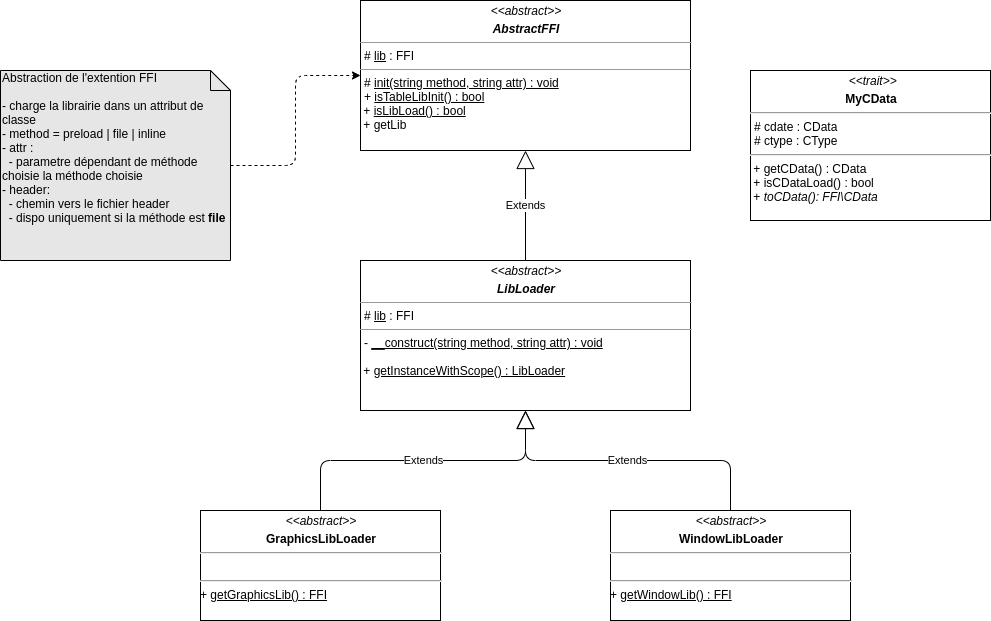

# Développement de la bibliothèque {#dev}

Impossible de parler du développement de la bibliothèque sans aborder le programme que je me suis fixé pour le faire.

## Programme de la mise en situation professionnelle.

La mise en situation professionnelle, se déroule dans un cadre du confinement donc il m'était dans l'obligation de faire du télétravail.

### Organisation

Dès le début je me suis fait un programme pour répartir convenablement les 4 semaines qui m'étaient donné pour la réalisation de la bibliothèque. 

- **Semaine 1** : documentation et découverte
- **Semaine 2** : Conception de l'architecture de la bibliothèque et template de développement
- **Semaine 3** : Développement de la bibliothèque
- **Semaine 4** : 
  - Poursuite de développement et distribution de la bibliothèque
  - Finalisation du mémoire

En plus de cette organisation hebdomadaire je me suis fixé un planning journalier.

| Horaire           | Activité |
|-------------------|----------|
| **09h00 - 13h00** | Projet   |
|      *Pause*      |          |
| **15h00 - 17h00** | Projet   |
|      *Pause*      |          |
| **18h00 - 20h00** | Mémoire  |

Je me suis également servi de trello qui fut d'une aide précieuse pour mettre en place toute cette organisation.

### Impression sur le télétravail

Objectivement j'ai pu respecté ce planning à 70%. Il est évident que travailler de chez soi n'est pas une compétence innée mais bien une compétence qui se pratique et s'améliore avec l'expérience. Il faut bien sûr apprendre à faire l'impasse sur certains divertissement sans pour autant se priver.

Avant de réellement commencer le développement de la bibliothèque il m'as fallu une période de documentation et de découverte qui a durée une semaine. Evidemment j'en avait besoin car avant cette mise en situation professionnel je ne connaissais rien de FFI ou de CSFML. Je vais résumé ce que j'ai pu apprendre en donnant les pré-requis au développement et fonctionnement de la bibliothèque.

### PHP FFI

L’extension FFI de PHP disponible à partir de la version 7.4 est obligatoirement pour développer et faire fonctionner la bibliothèque. Elle est intégré mais "inactive" par défaut [@the_php_group_ffi_2019] sauf si l'on utilise PHP en ligne de commande ou la fonctionnalité de pré-chargement de PHP en environnement web. Pour activer FFI il faut s'assurer d'avoir la librairie FFI `libffi` installé sur sa machine. [Sourceware libffi](https://sourceware.org/libffi/).

#### Installation de `libffi`

- Sur linux (Debian pour moi) la librairie est accessible via le paquet `libffi-dev`. Donc l'exécution de la commande suivante devrait installé le nécessaire pour activer l’extension FFI de PHP.

```bash
sudo apt install libffi-dev
```

- Sur Windows je n'ai pas explorer le processus d'installation mais il est disponible à l'adresse suivante :
[Goldencode.com : Building and Installing libffi on Windows](https://proj.goldencode.com/projects/p2j/wiki/Building_and_Installing_libffi_on_Windows)

#### Configuration/Activation de FFI

Après avoir installé `libffi`, il faut désormais l'activer. On peut le faire de plusieurs manières mais je détaillerai uniquement celle que j'utilise pour faire fonctionner la bibliothèque. Voir \@ref(utils-pre-requis).

### CSFML et SFML

CSFML est juste un pont vers la bibliothèque graphique SFML il faut donc installer SFML si l'on veut utiliser CSFML.
  
- Sur Debian, ces bibliothèques sont accessibles respectivement via les paquets `libsfml-dev` et `libcsfml-dev`

```bash
sudo apt install libsfml-dev libcsfml-dev
```

- Sur Windows on peut les télécharger sur le site officiel de la bibliothèque [sfml.org](https://www.sfml-dev.org/download.php)

 Après avoir eu ces dépendances sur ma machine, j'ai pu découvrir comment fonctionnait CSFML et SFML d'abord puis j'ai été capable de réaliser un programme en C qui affiche une fenêtre. Par la suite j'ai également réussi à écrire un script qui ouvre une fenêtre en PHP (accessible sur le dépôt git) utilisant CSFML et FFI fraîchement installé.
Maintenant que j'étais au point sur les dépendances de ma future bibliothèques j'ai pu commencé la phase de conception.

## Conception

En ce qui concerne la conception, je n'ai pas l'intention de détailler tout mon processus de réflexion mais juste d'éclaircir sur certains point clé de l'architecture de la bibliothèque.
La première chose dont je me suis donnée l'objectif de réaliser lors de ma phase de conception était de trouver une abstraction à la manipulation d'objets FFI.

### Ma première classe AbstractFFI


>  En informatique, le concept d'abstraction identifie et regroupe des caractéristiques et traitements communs applicables à des entités ou concepts variés ; une représentation abstraite commune de tels objets permet d'en simplifier et d'en unifier la manipulation. 
>
> --- [@wikipedia_abstraction_2019]

L'objectif est de ne pas utiliser directement FFI mais plutôt de passer par une classe intermédiaire. Cette abstraction devrait dans sa version la plus simple être capable de me retourner un objet FFI contenant la bibliothèque que je compte utiliser.
Je suis passé par différentes idée de conception, et j'ai fini par aboutir à cellui-ci.

```{r class-diagram-abstract-ffi, echo=FALSE, fig.cap="Diagramme de classe : AbstractFFI" ,fig.align='center', fig.width=8}



```

On y voit plusieurs classes abstraites, la principale étant `AbstractFFI` dont hérite `LibLoader`, leurs rôles est dans leur nom :

- **AbstractFFI** : la principale classe qui se charge de s'abstraire du chargement de la bibliothèque et de faire les vérifications nécessaires. Elle a comme attribut un tableau d'objets FFI pour permettre l'utilisation de plusieurs bibliothèque tout au long du programme.
- **LibLoader** : héritant de AbstractFFI elle a les mêmes fonctionnalités, mais en plus elle donne la base pour mettre en place un Singleton de génération de bibliothèque --- une classe limité à une instance dont le seul objectif est de retourner une bibliothèque précise.

Pour ce qui est de **MyCData**, il s'agit d'un `trait` --- particularité de PHP, c'est simplement une classe abstraite qui s'utilise comme une interface pour faire simple. Son objectifs est d'avoir un ensemble de fonctions et d'attribut prêtes à être réutiliser pour définir une donnée C qui serait importer de la bibliothèque chargé avec FFI.

### Architecture globale

Le reste de la bibliothèque est un ensemble de classe inspiré de SFML qui s’emboîtent autour de l'abstraction FFI. Effectivement, SFML et pas CSFML, car CSFML est écrit en C, or le C n'est pas un langage orienté objet et CSFML est juste un pont vers SFML qui est écrit en C++ qui lui est bien orienté objet. Toujours est-il que j'ai du simplifier un maximum l'architecture pour ne pas alourdir la bibliothèque en elle même et son utilisation finale.

### Exemple de la classe Window

La classe Window est le deuxième pilier de l'architecture de la bibliothèque, comme la plupart des classes elle utilise MyCData pour bénéficier des méthodes et des attributs lier à l'échange de données entre PHP et la bibliothèque C via FFI. C'est le cas de la méthode `toCData()` qui convertit les attributs actuel de la classe en donnée C.

### Diagramme de classe

Le résultat de la phase de conception est le diagramme de classe suivant qui a constamment évolué même lors de l'implémentation des fonctionnalités de la bibliothèque.

```{r class-diagramm, fig.cap="Diagramme de classe accessible à l'adresse https://cutt.ly/phpml-class-diagram", echo=FALSE, out.width="70%", dev='png', cache=TRUE, fig.align='center', screenshot.opts = list(delay = 5)}

knitr::include_app("https://app.diagrams.net/?lightbox=1&highlight=0000ff&edit=_blank&layers=1&nav=1&title=phpsfml-pre-class.drawio#Uhttps%3A%2F%2Fdrive.google.com%2Fuc%3Fid%3D1LxYoQHLD5Z8fzSt4P4RyekhaTM5EHoAT%26export%3Ddownload", height = "600px")

```

Le temps passé sur la réflexion de l'architecture de la bibliothèque n'a pas été en vain car il va nous permettre d'en gagner sur la partie principale qui est l'implémentation des fonctionnalités trouvées lors de la phase de conception.