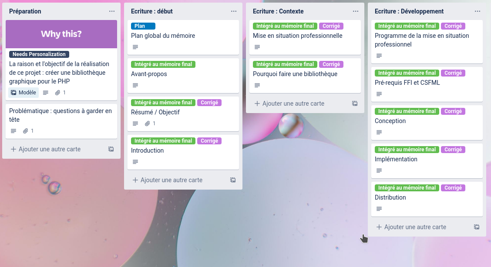

# (APPENDIX) Annexes {-}

# Trello

## Tableau trello au début du projet

## Tableau trello du mémoire

# Documentations

## Extrait de Documentation 1

## Extrait de Documentation 2

## Extrait de documentation textuelles

protected function addLib(string $method, string $attr, string $key) : void

: Instancie un objet FFI contenant une bibliothèque C selon la méthode de chargement, et l'ajoute à la liste de bibliothèque.
Si la bibliothèque est correctement chargé elle est accessible via l'attribut de classe $lib
     
    - **param** `string $method` la méthode de chargement de la bibliothèque C. N'accepte que trois valeur :
      - *inline* : une séquence de déclaration en C doit être fourni au second paramètre. Un tableau peut aussi être passé au second paramètre. La première valeur étant la séquence de déclaration en C, et la deuxième le fichier de la bibliothèque à charger.
      - *preload* : charge dans l'objet FFI une bibliothèque déjà préchargé par PHP.
      Dans ce cas le nom de l'espace de définition 'scope' doit être passer au second paramètre.
      - *file* : instancie l'objet FFI selon les déclarations C contenu dans un fichier preloading (.h) Le chemin vers le fichier doit être passer au second paramètre.
         
    - **param** `string $attr` dépend du premier paramètre.
    Elle peut recevoir une chaine de caractère représentant une séquence de déclaration en C ou un chemin vers le fichier h.
    Un tableau de taille 2 peut également être passé si la méthode est 'inline'.
    Si un type non attendu, un mauvais chemin ou une valeur contraire à la méthode définie est passé, un comportement non attendu pourrait survenir et la bibliothèque ne serait pas chargé.
         
    - **param** `string $key` clé d'accès à la bibliothèque ajouté.
